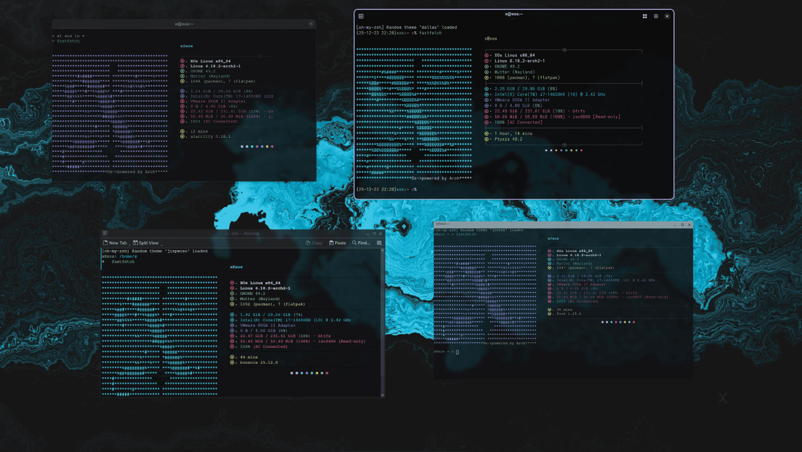

# Xscriptor Terminal schemes

A curated collection of **terminal themes and color schemes** designed for a consistent look & feel across **Windows**, **MacOs** & **Linux**.  
This repo includes configurations for PowerShell, Kitty, Gnome Terminal, Konsole, XFCE, and more.

## Supported:

| Terminal | Remote Install Command |
|----------|------------------------|
| [Alacritty](./alacritty/README.md) | `wget https://raw.githubusercontent.com/xscriptordev/terminal/main/alacritty/install.sh | bash` |
| [Foot](./foot/README.md) | `wget -qO- https://raw.githubusercontent.com/xscriptordev/terminal/main/foot/install.sh | bash` |
| [Ghostty](./ghostty/README.md) | `wget -qO- https://raw.githubusercontent.com/xscriptordev/terminal/main/ghostty/install.sh | bash` |
| [GNOME Terminal](./gnome-terminal/README.md) | `wget -qO- https://raw.githubusercontent.com/xscriptordev/terminal/main/gnome-terminal/install.sh | bash` |
| [Hyper](./hyper/README.md) | `wget -qO- https://raw.githubusercontent.com/xscriptordev/terminal/main/hyper/install.sh | bash` |
| [iTerm2](./iterm/README.md) | `wget -qO- https://raw.githubusercontent.com/xscriptordev/terminal/main/iterm/install.sh | bash` |
| [Kitty](./kitty/README.md) | `wget -qO- https://raw.githubusercontent.com/xscriptordev/terminal/main/kitty/install.sh | bash` |
| [Konsole](./konsole/README.md) | `wget -qO- https://raw.githubusercontent.com/xscriptordev/terminal/main/konsole/install.sh | bash` |
| [PowerShell (Windows)](./powershell/README.md) | `Set-ExecutionPolicy Bypass -Scope Process -Force; irm https://raw.githubusercontent.com/xscriptordev/terminal/main/powershell/install.ps1 | iex` |
| [Ptyxis](./ptyxis/README.md) | `wget -qO- https://raw.githubusercontent.com/xscriptordev/terminal/main/ptyxis/install.sh | bash` |
| [Termux (Android)](./termux/README.md) | `wget -qO- https://raw.githubusercontent.com/xscriptordev/terminal/main/termux/install.sh | bash` |
| [Terminator](./terminator/README.md) | `wget -qO- https://raw.githubusercontent.com/xscriptordev/terminal/main/terminator/install.sh | bash` |
| [Guake](./guake/README.md) | `wget -qO- https://raw.githubusercontent.com/xscriptordev/terminal/main/guake/install.sh | bash` |
| [WezTerm](./wezterm/README.md) | `wget -qO- https://raw.githubusercontent.com/xscriptordev/terminal/main/wezterm/install.sh | sh` |
| [Warp](./warp/README.md) | `wget -qO- https://raw.githubusercontent.com/xscriptordev/terminal/main/warp/install.sh | sh` |
| [XFCE Terminal](./xfce/README.md) | `wget -qO- https://raw.githubusercontent.com/xscriptordev/terminal/main/xfce/install.sh | sh` |
| [Terminal.app (macOS)](./terminal.app/README.md) | — |
| [Tilix](./tilix/README.md) | — |
| [PuTTY (Windows)](./putty/README.md) | — |
| [MobaXterm (Windows)](./mobaxterm/README.md) | — |

Note: In some directories you'll find an `install.sh` script you can run to simplify theme installation for the terminal you use.

## *Previews*:

  

