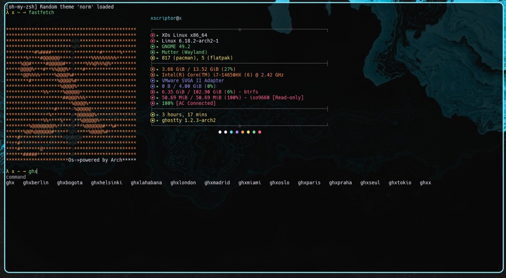
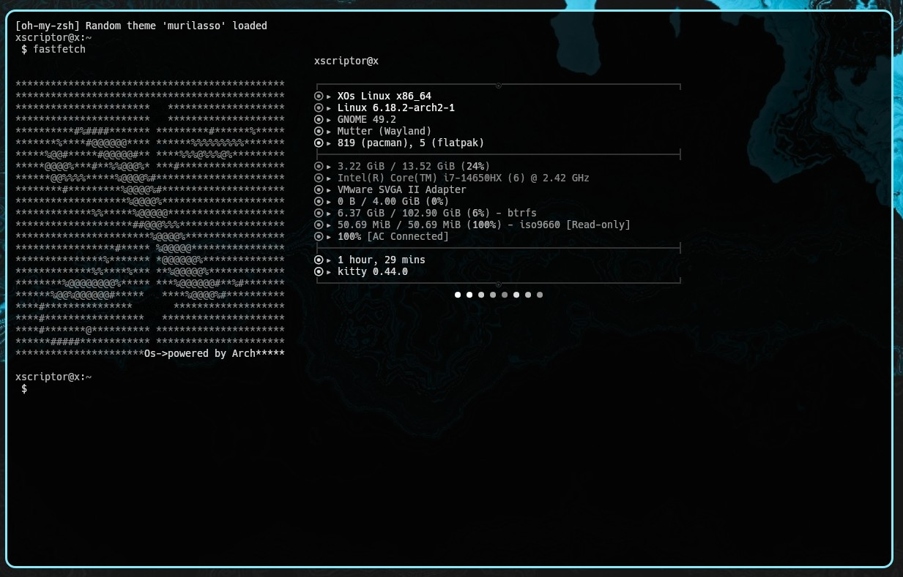
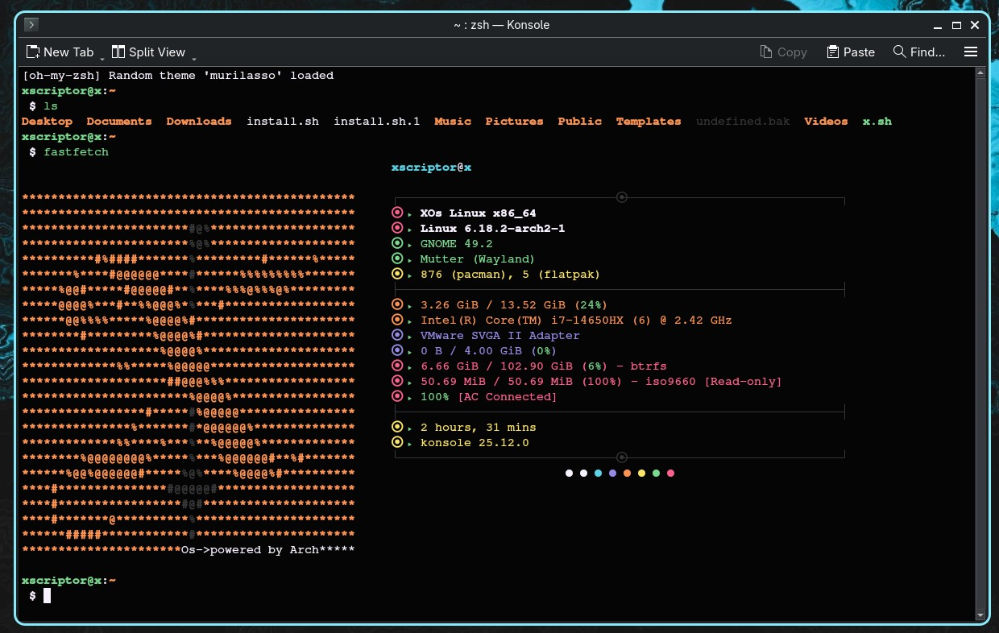

<h1 align="center">Terminal Xscriptor</h1>

    

My own collection of terminal themes and color schemes designed for a consistent look and feel across Windows, macOS, and Linux.

<h2 align="center">Table of Contents</h2>

<ul>
  <li><a href="#previews">Previews</a></li>
  <li><a href="#supported-terminals">Supported Terminals</a></li>
  <li><a href="#related-files">Related Files</a></li>
</ul>

<h2 align="center" id="previews">Previews</h2>

  

  
Click here to see more previews

  <table>
    <tr>
      <td align="center">
        
      </td>
      <td align="center">
        
      </td>
      <td align="center">
        
      </td>
      <td align="center">
        
      </td>
    </tr>
  </table>

<h2 align="center" id="supported-terminals">Supported Terminals</h2>

<h3>Universal Installer</h3>

You can use the universal installer to automatically configure the theme for your preferred terminal emulator. Just run the following command and select your terminal from the menu:

<pre><code>wget -qO- https://raw.githubusercontent.com/xscriptor/terminal/main/install.sh | bash</code></pre>

Alternatively, to make this easy to install manually, you can execute the remote install script directly for each terminal. You can see the details in each terminal's documentation.

  
View Installation Instructions for Supported Terminals

  <ul>
    <li>
      <a href="./alacritty/README.md">Alacritty</a>
      <pre><code>wget -qO- https://raw.githubusercontent.com/xscriptor/terminal/main/alacritty/install.sh | bash</code></pre>
    </li>
    <li>
      <a href="./foot/README.md">Foot</a>
      <pre><code>wget -qO- https://raw.githubusercontent.com/xscriptor/terminal/main/foot/install.sh | bash</code></pre>
    </li>
    <li>
      <a href="./ghostty/README.md">Ghostty</a>
      <pre><code>wget -qO- https://raw.githubusercontent.com/xscriptor/terminal/main/ghostty/install.sh | bash</code></pre>
    </li>
    <li>
      <a href="./gnome-terminal/README.md">GNOME Terminal</a>
      <pre><code>wget -qO- https://raw.githubusercontent.com/xscriptor/terminal/main/gnome-terminal/install.sh | bash</code></pre>
    </li>
    <li>
      <a href="./hyper/README.md">Hyper</a>
      <pre><code>wget -qO- https://raw.githubusercontent.com/xscriptor/terminal/main/hyper/install.sh | bash</code></pre>
    </li>
    <li>
      <a href="./iterm/README.md">iTerm2</a>
      <pre><code>wget -qO- https://raw.githubusercontent.com/xscriptor/terminal/main/iterm/install.sh | bash</code></pre>
    </li>
    <li>
      <a href="./kitty/README.md">Kitty</a>
      <pre><code>wget -qO- https://raw.githubusercontent.com/xscriptor/terminal/main/kitty/install.sh | bash</code></pre>
    </li>
    <li>
      <a href="./konsole/README.md">Konsole</a>
      <pre><code>wget -qO- https://raw.githubusercontent.com/xscriptor/terminal/main/konsole/install.sh | bash</code></pre>
    </li>
    <li>
      <a href="./mobaxterm/README.md">MobaXterm (Windows)</a>
    </li>
    <li>
      <a href="./powershell/README.md">PowerShell (Windows)</a>
       
      Remote install (Windows PowerShell 5.1):
      <pre><code>[Net.ServicePointManager]::SecurityProtocol = [Net.SecurityProtocolType]::Tls12
Set-ExecutionPolicy Bypass -Scope Process -Force
iex (iwr 'https://raw.githubusercontent.com/xscriptor/terminal/main/powershell/install.ps1' -UseBasicParsing).Content</code></pre>
      Remote install (PowerShell 7+):
      <pre><code>Set-ExecutionPolicy Bypass -Scope Process -Force
irm 'https://raw.githubusercontent.com/xscriptor/terminal/main/powershell/install.ps1' -Raw | iex</code></pre>
      Default one-liner:
      <pre><code>Set-ExecutionPolicy Bypass -Scope Process -Force
irm https://raw.githubusercontent.com/xscriptor/terminal/main/powershell/install.ps1 | iex</code></pre>
    </li>
    <li>
      <a href="./ptyxis/README.md">Ptyxis</a>
      <pre><code>wget -qO- https://raw.githubusercontent.com/xscriptor/terminal/main/ptyxis/install.sh | bash</code></pre>
    </li>
    <li>
      <a href="./putty/README.md">PuTTY (Windows)</a>
    </li>
    <li>
      <a href="./terminal.app/README.md">Terminal.app (macOS)</a>
    </li>
    <li>
      <a href="./terminator/README.md">Terminator</a>
      <pre><code>wget -qO- https://raw.githubusercontent.com/xscriptor/terminal/main/terminator/install.sh | bash</code></pre>
    </li>
    <li>
      <a href="./termux/README.md">Termux (Android)</a>
      <pre><code>wget -qO- https://raw.githubusercontent.com/xscriptor/terminal/main/termux/install.sh | bash</code></pre>
    </li>
    <li>
      <a href="./tilix/README.md">Tilix</a>
    </li>
    <li>
      <a href="./warp/README.md">Warp</a>
      <pre><code>wget -qO- https://raw.githubusercontent.com/xscriptor/terminal/main/warp/install.sh | bash</code></pre>
    </li>
    <li>
      <a href="./wezterm/README.md">WezTerm</a>
      <pre><code>wget -qO- https://raw.githubusercontent.com/xscriptor/terminal/main/wezterm/install.sh | bash</code></pre>
    </li>
    <li>
      <a href="./xfce/README.md">XFCE Terminal</a>
      <pre><code>wget -qO- https://raw.githubusercontent.com/xscriptor/terminal/main/xfce/install.sh | bash</code></pre>
    </li>
  </ul>
  
Note: In some directories you will find an <code>install.sh</code> script you can run to simplify theme installation for the terminal you use.

<h2 align="center" id="related-files">Related Files</h2>

<ul>
  <li><a href="./CONTRIBUTING.md">CONTRIBUTING.md</a></li>
  <li><a href="./CODE_OF_CONDUCT.md">CODE_OF_CONDUCT.md</a></li>
  <li><a href="./SECURITY.md">SECURITY.md</a></li>
  <li><a href="./SUPPORT.md">SUPPORT.md</a></li>
  <li><a href="./LICENSE">LICENSE</a></li>
</ul>

 

<strong>About the Developer</strong>

[X](https://github.com/xscriptor) | [XWeb](https://dev.xscriptor.com)

