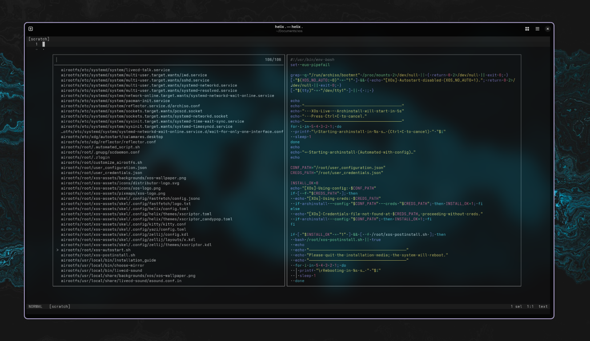
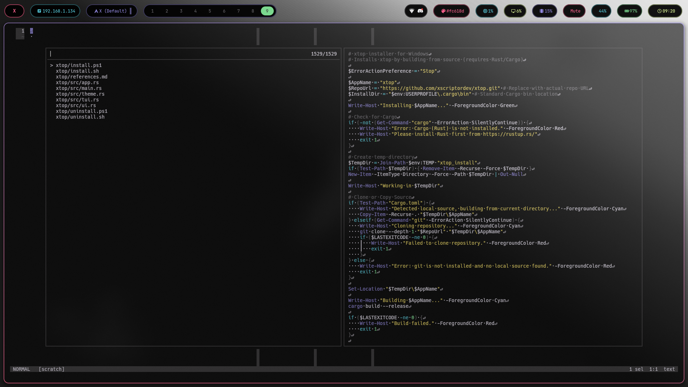
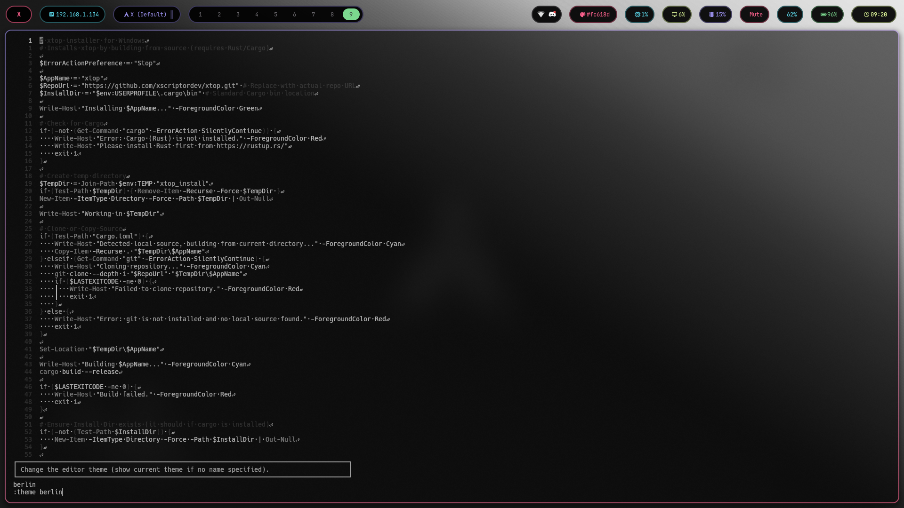
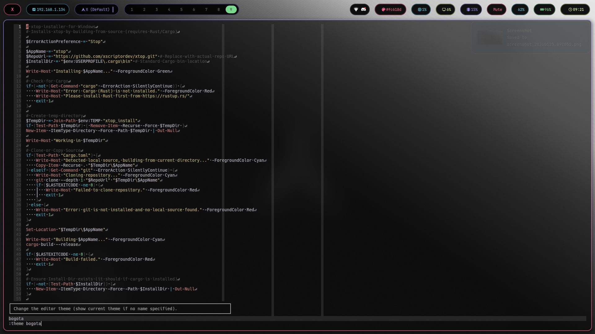

<h1 align="center"> Xscriptor Helix </h1>

   

Essential settings to improve accessibility of helix using the Xscriptor themes.

 
   

<h2 align="center">Table of Contents</h2>

  <a href="#previews">Previews</a> •
  <a href="#installation">Installation</a> •
  <a href="#script-options">Script Options</a> •
  <a href="#what-the-installer-does">What the installer does</a> •
  <a href="#requirements">Requirements</a> •
  <a href="#selecting-a-theme">Selecting a theme</a> •
  <a href="#related-documents">Related Documents</a> •
  <a href="#x">X</a> 

<h2 align="center" id="previews"> Previews </h2>

  

  
More previews

  <table align="center">
    <tr>
      <td align="center">
        
      </td>
      <td align="center">
        
      </td>
      <td align="center">
        
      </td>
    </tr>
  </table>

<h2 align="center" id="installation"> Installation </h2>

Quick remote install using curl or wget:

<pre><code># Complete (config + themes) with curl
sh -c "$(curl -fsSL https://raw.githubusercontent.com/xscriptor/helix/main/install.sh)" -- --complete

# Complete (config + themes) with wget
sh -c "$(wget -qO- https://raw.githubusercontent.com/xscriptor/helix/main/install.sh)" -- --complete</code></pre>

Other modes:

<pre><code># Themes only
sh -c "$(curl -fsSL https://raw.githubusercontent.com/xscriptor/helix/main/install.sh)" -- --themes-only
sh -c "$(wget -qO- https://raw.githubusercontent.com/xscriptor/helix/main/install.sh)" -- --themes-only

# Minimal config + themes
sh -c "$(curl -fsSL https://raw.githubusercontent.com/xscriptor/helix/main/install.sh)" -- --minimal
sh -c "$(wget -qO- https://raw.githubusercontent.com/xscriptor/helix/main/install.sh)" -- --minimal

# Custom branch or repository
sh -c "$(curl -fsSL https://raw.githubusercontent.com/xscriptor/helix/main/install.sh)" -- --branch main --repo https://github.com/xscriptor/helix
sh -c "$(wget -qO- https://raw.githubusercontent.com/xscriptor/helix/main/install.sh)" -- --branch main --repo https://github.com/xscriptor/helix</code></pre>

<h2 align="center" id="script-options"> Script Options </h2>

<ul>
  <li>--themes-only: install only themes</li>
  <li>--minimal: install minimal config + themes</li>
  <li>--complete: install complete config + themes (default)</li>
  <li>--branch &lt;name&gt;: remote branch to use (default: main)</li>
  <li>--repo &lt;url&gt;: remote repository URL (default: https://github.com/xscriptor/helix)</li>
  <li>--dry-run: show actions without executing</li>
  <li>--force: overwrite without creating backup</li>
  <li>--no-backup: do not create a backup of existing config</li>
  <li>--help: show help</li>
</ul>

<h2 align="center" id="what-the-installer-does"> What the installer does </h2>

<ul>
  <li>Detects local repository or downloads it remotely:
    <ul>
      <li>Uses git if available, otherwise downloads a tarball via curl or wget and extracts it with tar.</li>
    </ul>
  </li>
  <li>Installs themes into ~/.config/helix/themes from the repository <a href="./themes">themes</a>.</li>
  <li>Installs either minimal or complete Helix config into ~/.config/helix/config.toml from:
    <ul>
      <li>Minimal: <a href="./settings/minimal/config.toml">settings/minimal/config.toml</a></li>
      <li>Complete: <a href="./settings/complete/config.toml">settings/complete/config.toml</a></li>
    </ul>
  </li>
  <li>Creates a timestamped backup of an existing ~/.config/helix/config.toml by default. You can disable it with --no-backup or bypass with --force.</li>
  <li>Default mode is --complete to leave Helix ready with the “x” theme; you can switch later to any theme included.</li>
</ul>

<h2 align="center" id="requirements"> Requirements </h2>

<ul>
  <li>Helix installed on your system</li>
  <li>git (optional), curl or wget, and tar (required for non-git download)</li>
</ul>

<h2 align="center" id="selecting-a-theme"> Selecting a theme </h2>

Set a theme in your Helix config:

<pre><code>theme = "x"</code></pre>

Available themes are installed in ~/.config/helix/themes (e.g., "oslo", "tokio", "berlin", etc.). Change the value to any theme filename (without .toml).

<h2 align="center" id="related-documents">Related Documents</h2>

<ul>
  <li><a href="./LICENSE">License</a></li>
  <li><a href="./CODE_OF_CONDUCT.md">Code of Conduct</a></li>
  <li><a href="./CONTRIBUTING.md">Contributions</a></li>
  <li><a href="./ROADMAP.md">Roadmap</a></li>
  <li><a href="./colors.md">Colors</a></li>
</ul>

<h2 align="center" id="x">X</h2>

<a href="https://github.com/xscriptor">XGitHub</a> &middot;
<a href="https://dev.xscriptor.com">XWeb</a>

