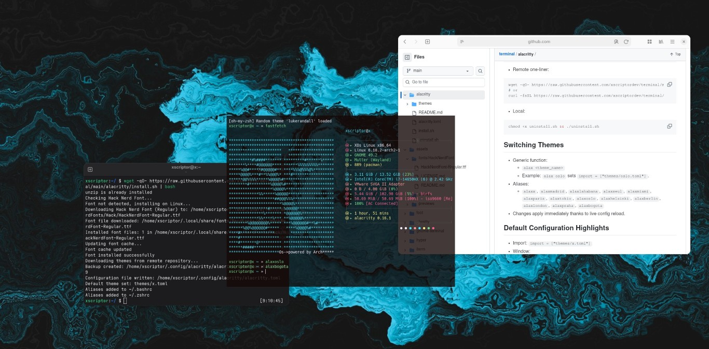
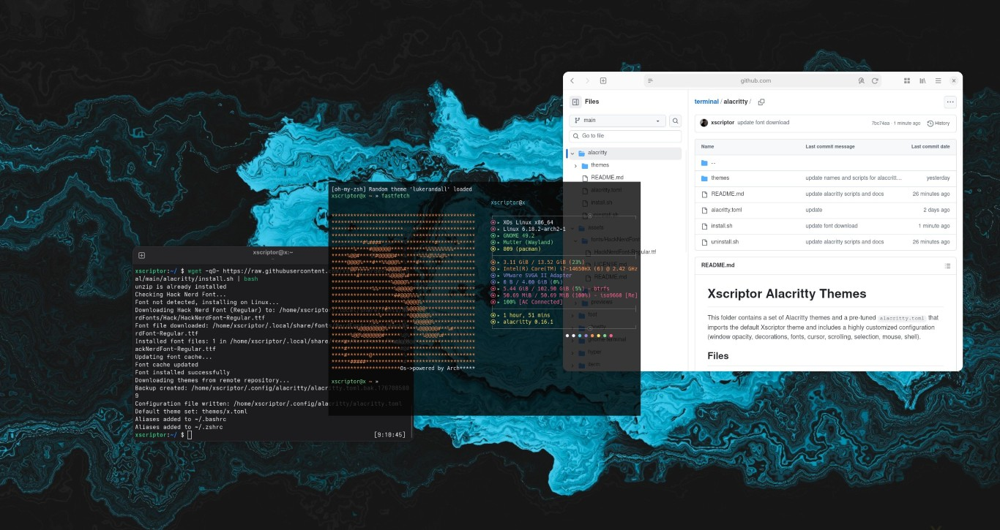

# Xscriptor Alacritty Themes

## Previews

<p align="center">
  
</p>
<p align="center">
  
  
</p>

## Installation
- You can install runing the following command:
```bash
 wget -qO- https://raw.githubusercontent.com/xscriptordev/terminal/main/alacritty/install.sh | bash
```

or

- Download the repo, go to the folder and run the installer:
  - `chmod +x install.sh && ./install.sh`
- What it does:
  - Copies all `themes/*.toml` into `~/.config/alacritty/themes`.
  - Backs up any existing config to `~/.config/alacritty/alacritty.toml.bak.<timestamp>`.
  - Installs the provided `alacritty.toml` to `~/.config/alacritty/alacritty.toml`.
  - Ensures the import line is set to `themes/x.toml`.
  - Appends shell aliases to `~/.bashrc` and `~/.zshrc`.
- Reload your shell session:
  - `source ~/.bashrc` or `source ~/.zshrc`

## Uninstall
- Remote one‑liner:
```bash
wget -qO- https://raw.githubusercontent.com/xscriptordev/terminal/main/alacritty/uninstall.sh | bash
# or
curl -fsSL https://raw.githubusercontent.com/xscriptordev/terminal/main/alacritty/uninstall.sh | bash
```
- Local:
```bash
chmod +x uninstall.sh && ./uninstall.sh
```

## Switching Themes
- Generic function:
  - `alax <theme_name>`
  - Example: `alax oslo` sets `import = ["themes/oslo.toml"]`.
- Aliases:
  - `alaxx`, `alaxmadrid`, `alaxlahabana`, `alaxseul`, `alaxmiami`, `alaxparis`, `alaxtokio`, `alaxoslo`, `alaxhelsinki`, `alaxberlin`, `alaxlondon`, `alaxpraha`, `alaxbogota`
- Changes apply immediately thanks to live config reload.

## Default Configuration Highlights
- Import: `import = ["themes/x.toml"]`
- Window:
  - `opacity = 0.92`
  - `decorations = "None"`
  - `dynamic_padding = true`, `padding.x = 6`, `padding.y = 6`
  - `startup_mode = "Windowed"`, dynamic title enabled
- Font:
  - `AnonymicePro Nerd Font`, `size = 13.0`
- Cursor:
  - `Beam`, blinking on, thickness `0.12`
- Scrolling:
  - `history = 10000`, `multiplier = 3`
- Selection:
  - `save_to_clipboard = true`
- Mouse:
  - `hide_when_typing = true`
- Shell:
  - `zsh` (`/usr/bin/zsh`, args `-l`)
- Env:
  - `TERM = "alacritty"`, `COLORTERM = "truecolor"`

## Notes
- Only the new theme names are supported; no legacy names are used or accepted.
- Installed theme files in `~/.config/alacritty/themes` use the new naming (`<name>.toml`).
- Theme import path is relative to `~/.config/alacritty/alacritty.toml`. The installer sets it to `themes/<file>.toml`.
- Aliases replace the `import = [...]` line with `sed`. If you have custom imports, ensure a single `import = [...]` line exists.
- If the font family name differs on your system, update `[font]` in `~/.config/alacritty/alacritty.toml` accordingly.

## Troubleshooting
- Aliases not found:
  - Run `source ~/.bashrc` or `source ~/.zshrc`.
- Font missing:
  - Install `AnonymicePro Nerd Font`, or change `font.normal.family` to a font available on your system (`fc-list : family style` can help).
- Theme change not visible:
  - Ensure `live_config_reload = true` is present in the config.
