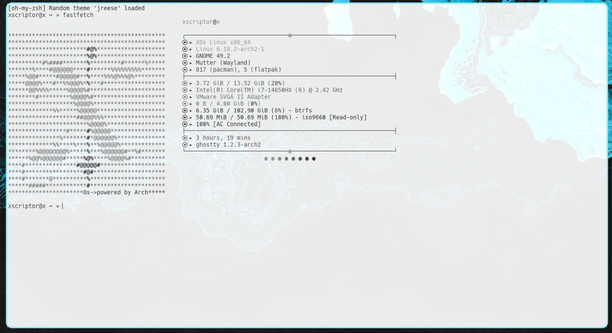
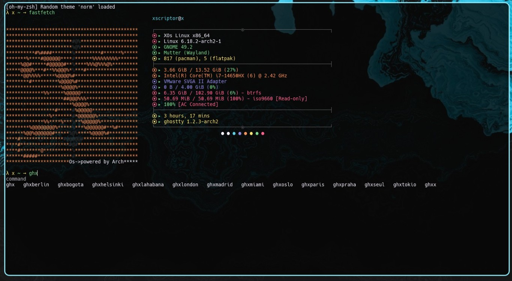

# Xscriptor Ghostty Themes

---
## Previews

<p align="center">
  
  
</p>


## Files
- `config`: Base Ghostty configuration that sets `x.ini` and other defaults.
- `install.sh`: Installs themes and configuration, ensures dependencies, and adds shell aliases for fast theme switching.
- `themes/*.ini`: Theme files ready to be used by Ghostty:
  - `x.ini`
  - `madrid.ini`
  - `lahabana.ini`
  - `seul.ini`
  - `miami.ini`
  - `paris.ini`
  - `tokio.ini`
  - `oslo.ini`
  - `helsinki.ini`
  - `berlin.ini`
  - `london.ini`
  - `praha.ini`
  - `bogota.ini`

## Requirements
- Ghostty installed.
- `sed`, `bash` or `zsh`.
- `fontconfig` (`fc-list`), `curl` or `wget`, `unzip`.
- A Nerd Font installed, specifically `Hack Nerd Font` (installer tries to install it automatically).

## Installation
- One-liner:
```bash
wget -qO- https://raw.githubusercontent.com/xscriptordev/terminal/main/ghostty/install.sh | bash
```

or

- Download the repo, go to the folder and run the installer:
  - `chmod +x install.sh && ./install.sh`
- What the installer does:
  - Detects your package manager and installs any missing dependencies (`ghostty`, `sed`, `fontconfig`, `curl/wget`, `unzip`).
  - Verifies `Hack Nerd Font`; if missing, downloads and installs it (Linux/macOS).
  - Copies all `themes/*.ini` into `~/.config/ghostty/themes` (or downloads them from the repo if not present locally).
  - Backs up any existing config to `~/.config/ghostty/config.bak.<timestamp>`.
  - Installs the provided `config` to `~/.config/ghostty/config` and (on macOS) also writes to `~/Library/Application Support/com.mitchellh.ghostty/config`.
- Ensures the default theme line is `theme = x.ini`.
- Appends shell aliases to `~/.bashrc` and `~/.zshrc`.
- Reload your shell session:
  - `source ~/.bashrc` or `source ~/.zshrc`

## Uninstall
- Remote one‑liner:
```bash
wget -qO- https://raw.githubusercontent.com/xscriptordev/terminal/main/ghostty/uninstall.sh | bash
# or
curl -fsSL https://raw.githubusercontent.com/xscriptordev/terminal/main/ghostty/uninstall.sh | bash
```
- Local:
```bash
chmod +x uninstall.sh && ./uninstall.sh
```

## Switching Themes
- Generic function:
  - `ghx <theme_name>`
  - Example: `ghx oslo` writes `theme = oslo.ini` in `~/.config/ghostty/config`.
- Ready-to-use aliases:
  - `ghxx`, `ghxmadrid`, `ghxlahabana`, `ghxseul`, `ghxmiami`, `ghxparis`, `ghxtokio`, `ghxoslo`, `ghxhelsinki`, `ghxberlin`, `ghxlondon`, `ghxpraha`, `ghxbogota`

## Default Configuration Highlights
- `ghostty/config`:
  - `theme = x.ini`
  - `font-family = Hack Nerd Font`
  - `font-family = Noto Color Emoji`
  - `font-size = 10`
  - `cursor-style = block`
  - `cursor-style-blink = true`
  - `copy-on-select = clipboard`
  - `mouse-hide-while-typing = true`
  - `mouse-scroll-multiplier = 2`
  - `window-decoration = false`
  - `macos-titlebar-style = hidden`
  - `window-save-state = always`
  - `window-padding-x = 0`
  - `window-padding-y = 0`
  - `window-padding-balance = true`
  - `window-padding-color = extend`
  - `background-opacity = 0.80`
  - `background-blur = true`
  - `gtk-single-instance = desktop`
  - `shell-integration = detect`
  - `shell-integration-features = cursor,sudo,title`
  - Keybinds for reload/new window/tab and splits (Linux/macOS variants).

## Notes
- Ghostty looks up theme files by name in `~/.config/ghostty/themes`. The installer writes `theme = x.ini`.
- Aliases update the single `theme` line in `~/.config/ghostty/config`. If you maintain multiple configs (e.g. macOS App Support path), you can duplicate the change manually.
- If your font family differs, adjust `font-family` in `~/.config/ghostty/config` and verify with `ghostty +list-fonts`.
- On Wayland compositors and macOS, background blur behavior depends on OS/DE capabilities; set `background-blur` and `background-opacity` to taste.
- When running in single-instance mode, opening a new window applies the updated config; otherwise restart Ghostty if some options don’t reload live.

## Troubleshooting
- Aliases not available:
  - Run `source ~/.bashrc` or `source ~/.zshrc`.
- Font not detected:
  - Re-run the installer or set `font-family` to a Nerd Font you already have; confirm with `fc-list` (Linux) or Ghostty’s `+list-fonts`.
- Theme change not visible:
  - Ensure the theme file exists in `~/.config/ghostty/themes` and `theme = <name>.ini` is present in config; open a new Ghostty window.
