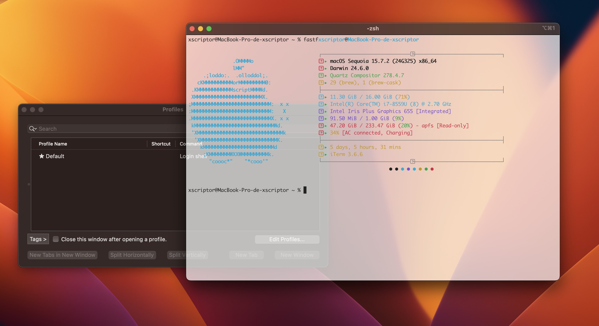
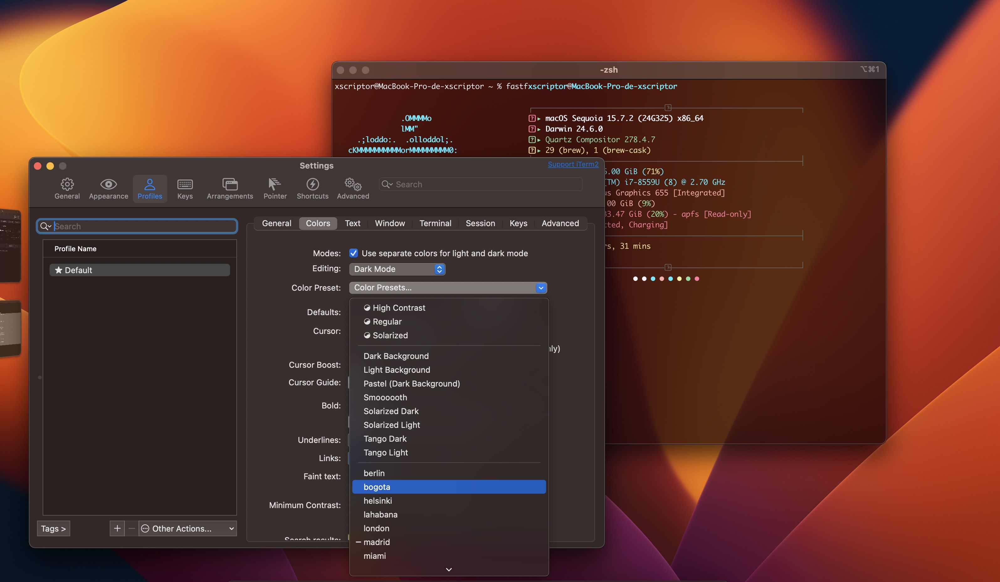

# Xscriptor iTerm2 Themes

<p align="center">
  
</p>

<p align="center">
  
</p>


## Files
Location: `./themes`
- `x.itermcolors`
- `madrid.itermcolors`
- `lahabana.itermcolors`
- `seul.itermcolors`
- `miami.itermcolors`
- `paris.itermcolors`
- `tokio.itermcolors`
- `oslo.itermcolors`
- `helsinki.itermcolors`
- `berlin.itermcolors`
- `london.itermcolors`
- `praha.itermcolors`
- `bogota.itermcolors`

## Requirements
- macOS with iTerm2 installed
- `curl` or `wget`

## Installation
- One-liner:
```bash
wget -qO- https://raw.githubusercontent.com/xscriptordev/terminal/main/iterm/install.sh | bash
```
or
- Local run:
```bash
cd iterm
chmod +x install.sh && ./install.sh
```

What it does:
- Uses local `.itermcolors` files from `./themes` if present, otherwise downloads them from the repository.
- Imports each preset by opening it with the system (`open`), adding it to iTerm2’s Color Presets.
- Does not modify your iTerm2 profiles or preferences; selection is manual.

## Using the Themes
- Open iTerm2 → Preferences → Profiles → Colors.
- Click `Color Presets…` → select the imported preset.
- Optional: set the profile as default under `Profiles`.

## Notes
- iTerm2 stores color settings per profile; presets are imported then applied manually to a profile.
- If import does not appear, quit and reopen iTerm2 after running the installer.
- For preset details and behavior, see iTerm2 documentation.

## Uninstall
- Remote one‑liner:
```bash
wget -qO- https://raw.githubusercontent.com/xscriptordev/terminal/main/iterm/uninstall.sh | bash
# or
curl -fsSL https://raw.githubusercontent.com/xscriptordev/terminal/main/iterm/uninstall.sh | bash
```
- Local:
```bash
chmod +x uninstall.sh && ./uninstall.sh
```
