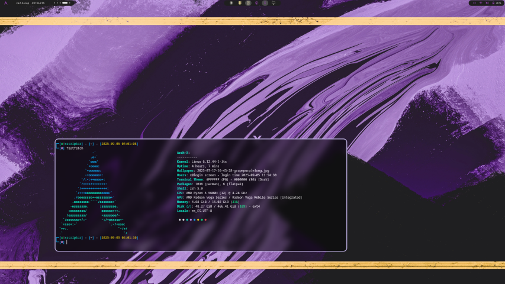

# xtropicalneon theme for Kitty

### [xtropicalneon](./kitty.conf)

<p align="center">
  
</p>

## Installation Instructions

1. **Download the `kitty.conf` file**  
    Copy it to your configuration path:
    ```bash
    ~/.config/kitty/
    ```


2. **Use it as a theme include**  
    Create the theme directory if it doesn’t exist:
```bash
mkdir -p ~/.config/kitty/themes/xtropicalneon
```
    Then include the theme in your main config file:

```bash
echo "include themes/xtropicalneon/kitty.conf" >> ~/.config/kitty/kitty.conf
```