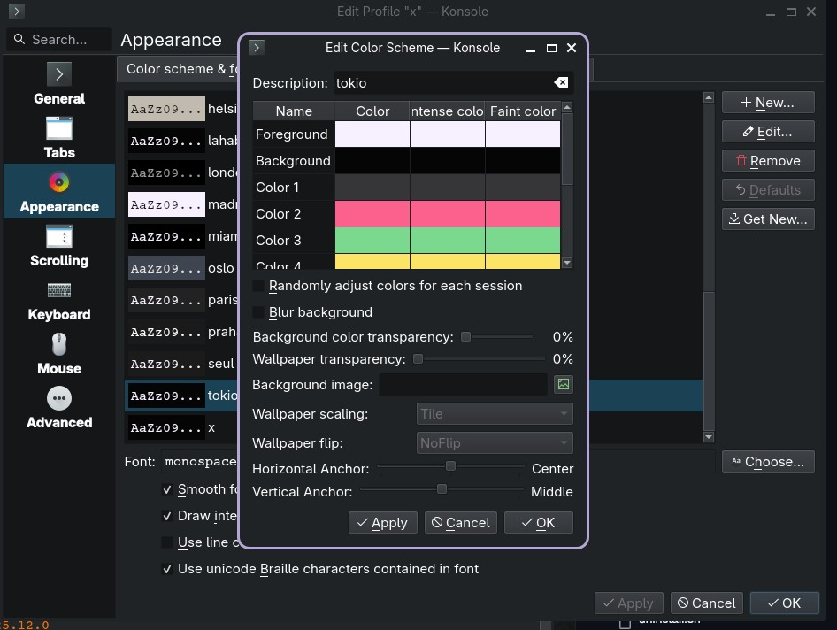
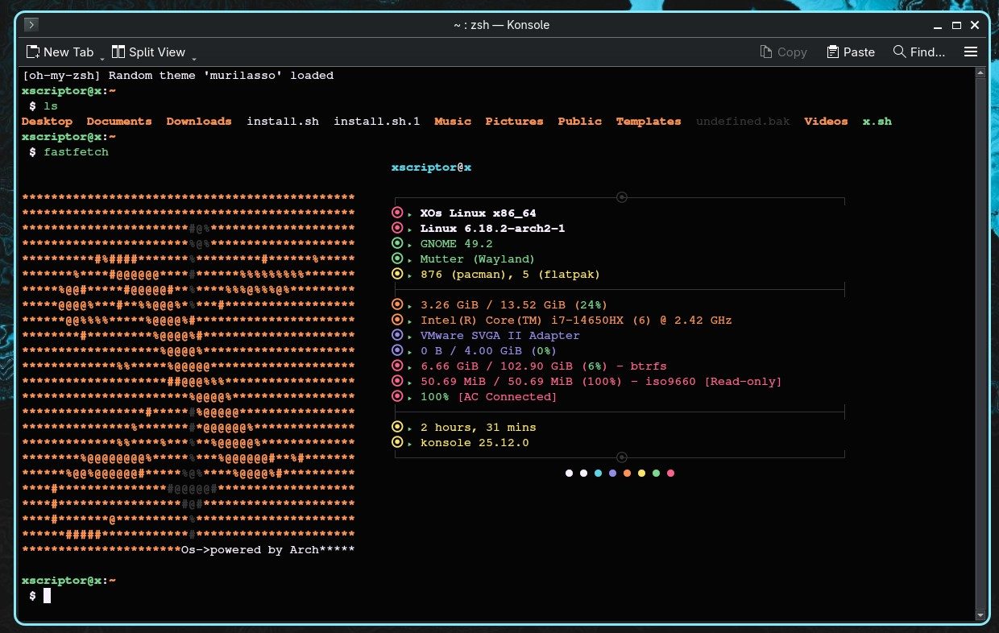
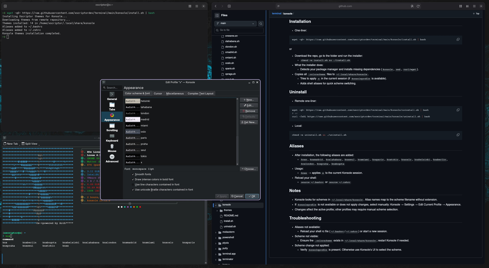

# Xscriptor Konsole Themes

<p align="center">

</p>

<p align="center">
  
  
</p>

## Files
- `install.sh`: Installs themes to `~/.local/share/konsole` and adds aliases for switching schemes.
- `themes/*.colorscheme`: Color scheme files ready for Konsole:
  - `x.colorscheme`
  - `madrid.colorscheme`
  - `lahabana.colorscheme`
  - `seul.colorscheme`
  - `miami.colorscheme`
  - `paris.colorscheme`
  - `tokio.colorscheme`
  - `oslo.colorscheme`
  - `helsinki.colorscheme`
  - `berlin.colorscheme`
  - `london.colorscheme`
  - `praha.colorscheme`
  - `bogota.colorscheme`

## Requirements
- Konsole installed.
- `sed`, `bash` or `zsh`.
- `curl` or `wget`.
- `konsoleprofile` (part of Konsole) to apply schemes from aliases.

## Installation
- One-liner:
```bash
wget -qO- https://raw.githubusercontent.com/xscriptordev/terminal/main/konsole/install.sh | bash
```

or

- Download the repo, go to the folder and run the installer:
  - `chmod +x install.sh && ./install.sh`
- What the installer does:
  - Detects your package manager and installs missing dependencies (`konsole`, `sed`, `curl/wget`).
- Copies all `.colorscheme` files to `~/.local/share/konsole`.
  - Tries to apply `x` in the current session (if `konsoleprofile` is available).
  - Adds shell aliases for quick scheme switching.

## Uninstall
- Remote one‑liner:
```bash
wget -qO- https://raw.githubusercontent.com/xscriptordev/terminal/main/konsole/uninstall.sh | bash
# or
curl -fsSL https://raw.githubusercontent.com/xscriptordev/terminal/main/konsole/uninstall.sh | bash
```
- Local:
```bash
chmod +x uninstall.sh && ./uninstall.sh
```

## Aliases
- After installation, the following aliases are added:
  - `knxx`, `knxmadrid`, `knxlahabana`, `knxseul`, `knxmiami`, `knxparis`, `knxtokio`, `knxoslo`, `knxhelsinki`, `knxberlin`, `knxlondon`, `knxpraha`, `knxbogota`
- Usage:
  - `knxx` → applies `x` to the current Konsole session.
- Reload your shell:
  - `source ~/.bashrc` or `source ~/.zshrc`

## Notes
- Konsole looks for schemes in `~/.local/share/konsole`. Alias names map to the scheme filename without extension.
- If `konsoleprofile` is not available or does not apply changes, select manually: Konsole → Settings → Edit Current Profile → Appearance.
- Changes affect the active profile; other profiles may require manual scheme selection.

## Troubleshooting
- Aliases not available:
  - Reload your shell rc file (`~/.bashrc`/`~/.zshrc`) or start a new session.
- Scheme not visible:
  - Ensure the `.colorscheme` exists in `~/.local/share/konsole`; restart Konsole if needed.
- Scheme change not applied:
  - Verify `konsoleprofile` is present. Otherwise use Konsole’s UI to select the scheme.
