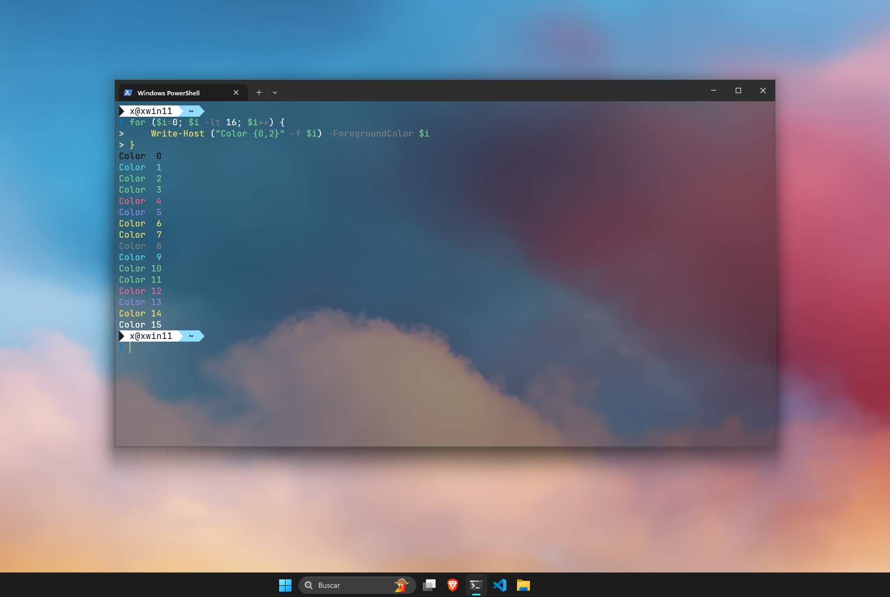
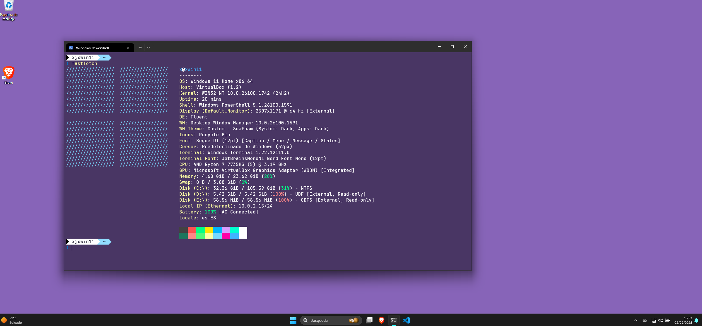

# Customizations for windows powershell

---

## Previews

<p align="center">
  
  
</p>

## Instructions:

- Download.
- Run:
     ```ps1
     Set-ExecutionPolicy Bypass -Scope Process -Force
     .\script.ps1
     ```
- Select the schema in the Powershell config.
- Restart Powershell.


- **Themes**:
    - [Xscriptor Theme](./xscriptor-theme/script.ps1)
    - [xtropicalneon](./xtropicalneon/README.md)


Note: To see the current Colors:
```ps1
for ($i=0; $i -lt 16; $i++) {
    Write-Host ("Color {0,2}" -f $i) -ForegroundColor $i
}

```