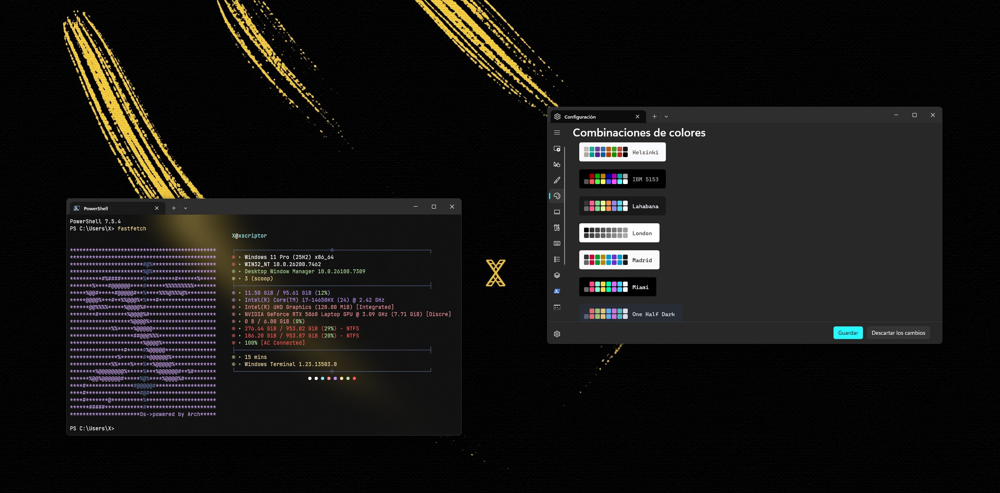
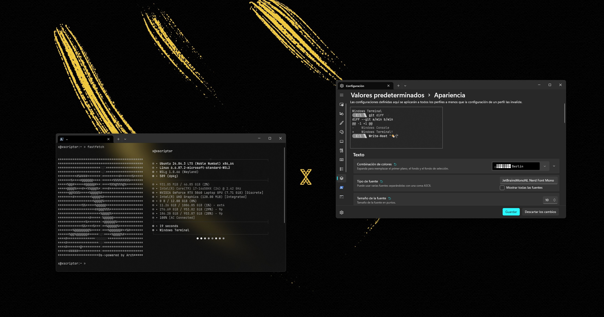
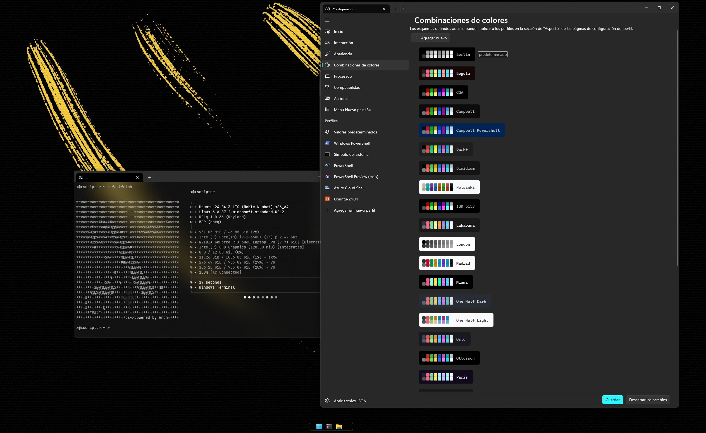

# Xscriptor PowerShell / Windows Terminal / WSL Themes

---

## Previews

<p align="center">
  
</p>
<p align="center">
  
</p>
<p align="center">
  
  
</p>
<p align="center">

</p>


## Quick Install

- Open PowerShell
- Run:
  ```powershell
  Set-ExecutionPolicy Bypass -Scope Process -Force
  .\powershell\install.ps1
  ```
- This imports all themes from [themes](https://github.com/xscriptordev/terminal/tree/main/powershell/themes) into Windows Terminal and sets “x” for PowerShell profiles
- Restart Windows Terminal (or PowerShell if launched inside it)

## Remote Install

- Remote install (Windows PowerShell 5.1):
  ```powershell
  [Net.ServicePointManager]::SecurityProtocol = [Net.SecurityProtocolType]::Tls12
  Set-ExecutionPolicy Bypass -Scope Process -Force
  iex (iwr 'https://raw.githubusercontent.com/xscriptordev/terminal/main/powershell/install.ps1' -UseBasicParsing).Content
  ```
- Remote install (PowerShell 7+):
  ```powershell
  Set-ExecutionPolicy Bypass -Scope Process -Force
  irm 'https://raw.githubusercontent.com/xscriptordev/terminal/main/powershell/install.ps1' -Raw | iex
  ```
- Default one-liner:
  ```powershell
  Set-ExecutionPolicy Bypass -Scope Process -Force
  irm https://raw.githubusercontent.com/xscriptordev/terminal/main/powershell/install.ps1 | iex
  ```
- Alternative (PS 5.1, download to TEMP and run):
  ```powershell
  [Net.ServicePointManager]::SecurityProtocol = [Net.SecurityProtocolType]::Tls12
  Set-ExecutionPolicy Bypass -Scope Process -Force
  $localPath = "$env:TEMP\install-xscriptor.ps1"
  Invoke-WebRequest 'https://raw.githubusercontent.com/xscriptordev/terminal/main/powershell/install.ps1' -OutFile $localPath -UseBasicParsing
  & $localPath
  ```
- With a specific scheme:
  ```powershell
  Set-ExecutionPolicy Bypass -Scope Process -Force
  $u='https://raw.githubusercontent.com/xscriptordev/terminal/main/powershell/install.ps1'; $p="$env:TEMP\\install.ps1"; iwr $u -UseBasicParsing -OutFile $p; & $p -SetSchemeName 'oslo'
  ```
- Notes:
  - The installer detects your settings.json automatically (Store/WinGet)
  - If the local themes directory is not present, it downloads themes from the repo and imports them


## Uninstall

- PowerShell (Windows)

  Remote uninstall (Windows PowerShell 5.1):
  
  ```powershell
  [Net.ServicePointManager]::SecurityProtocol = [Net.SecurityProtocolType]::Tls12
  Set-ExecutionPolicy Bypass -Scope Process -Force
  iex (iwr 'https://raw.githubusercontent.com/xscriptordev/terminal/main/powershell/uninstall.ps1' -UseBasicParsing).Content
  ```

  Remote uninstall (PowerShell 7+):
  
  ```powershell
  Set-ExecutionPolicy Bypass -Scope Process -Force
  irm 'https://raw.githubusercontent.com/xscriptordev/terminal/main/powershell/uninstall.ps1' -Raw | iex
  ```

  Default one-liner:
  
  ```powershell
  Set-ExecutionPolicy Bypass -Scope Process -Force
  irm https://raw.githubusercontent.com/xscriptordev/terminal/main/powershell/uninstall.ps1 | iex
  ```

  Restore from backup:
  
  ```powershell
  Set-ExecutionPolicy Bypass -Scope Process -Force
  $u='https://raw.githubusercontent.com/xscriptordev/terminal/main/powershell/uninstall.ps1'; $p="$env:TEMP\\uninstall.ps1"; iwr $u -UseBasicParsing -OutFile $p; & $p -Restore
  ```


### Choose a specific theme
- Pass the exact scheme name:
  ```powershell
  Set-ExecutionPolicy Bypass -Scope Process -Force
  .\powershell\install.ps1 -SetSchemeName "oslo"
  ```
- Available names include:
  - x, madrid
  - lahabana, seul
  - miami, paris, tokio
  - oslo, helsinki
  - berlin, london
  - praha, bogota

## Manual Install

- Open Windows Terminal settings.json:
  - Store path: `%LOCALAPPDATA%\Packages\Microsoft.WindowsTerminal_8wekyb3d8bbwe\LocalState\settings.json`
  - WinGet path: `%LOCALAPPDATA%\Microsoft\Windows Terminal\settings.json`
- Copy the “schemes” object from any file in [themes](https://github.com/xscriptordev/terminal/tree/main/powershell/themes) into the top-level `"schemes": []` array of your settings.json
- In your PowerShell profile, set:
  ```json
  "colorScheme": "x"
  ```
- Optionally set defaults:
  ```json
  "profiles": { "defaults": { "colorScheme": "x" } }
  ```
- Save and restart Windows Terminal

## Themes

- Dark:
  - [x.json](https://github.com/xscriptordev/terminal/blob/main/powershell/themes/x.json)
  - [lahabana.json](https://github.com/xscriptordev/terminal/blob/main/powershell/themes/lahabana.json)
  - [seul.json](https://github.com/xscriptordev/terminal/blob/main/powershell/themes/seul.json)
  - [miami.json](https://github.com/xscriptordev/terminal/blob/main/powershell/themes/miami.json)
  - [paris.json](https://github.com/xscriptordev/terminal/blob/main/powershell/themes/paris.json)
  - [tokio.json](https://github.com/xscriptordev/terminal/blob/main/powershell/themes/tokio.json)
  - [praha.json](https://github.com/xscriptordev/terminal/blob/main/powershell/themes/praha.json)
  - [bogota.json](https://github.com/xscriptordev/terminal/blob/main/powershell/themes/bogota.json)
- Light:
  - [madrid.json](https://github.com/xscriptordev/terminal/blob/main/powershell/themes/madrid.json)
- Nord:
  - [oslo.json](https://github.com/xscriptordev/terminal/blob/main/powershell/themes/oslo.json)
  - [helsinki.json](https://github.com/xscriptordev/terminal/blob/main/powershell/themes/helsinki.json)
- Greyscale:
  - [berlin.json](https://github.com/xscriptordev/terminal/blob/main/powershell/themes/berlin.json)
  - [london.json](https://github.com/xscriptordev/terminal/blob/main/powershell/themes/london.json)

## Notes

- The installer automatically detects settings.json location (Store/WinGet)
- It replaces existing schemes with the same name to keep them in sync
- Set profiles.defaults.colorScheme to apply your choice to all new profiles
