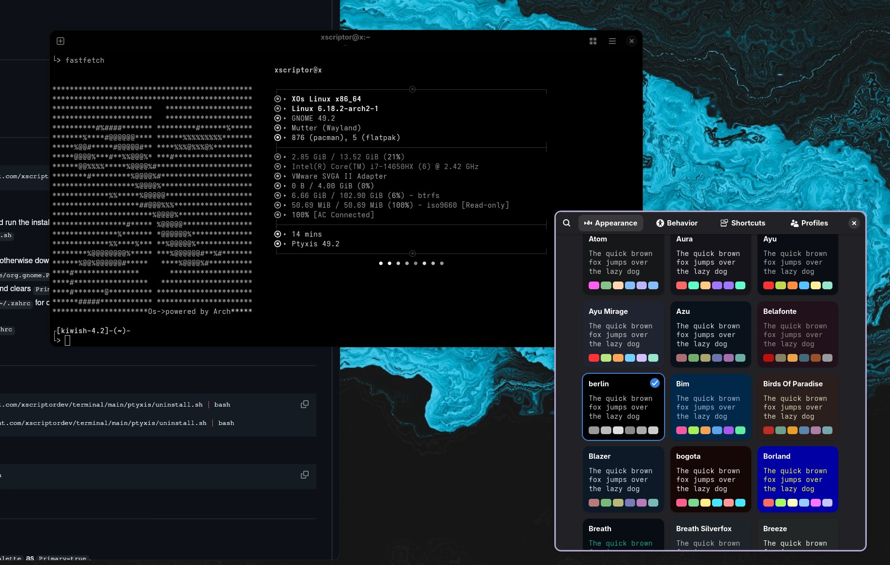
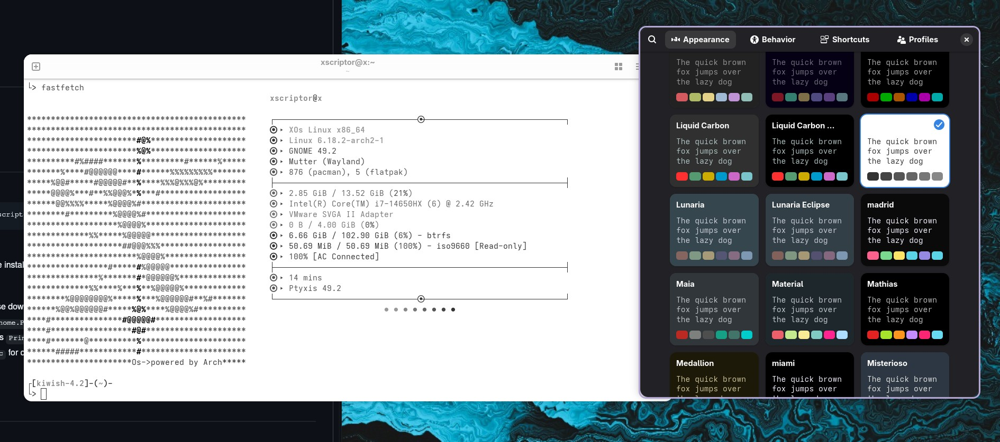
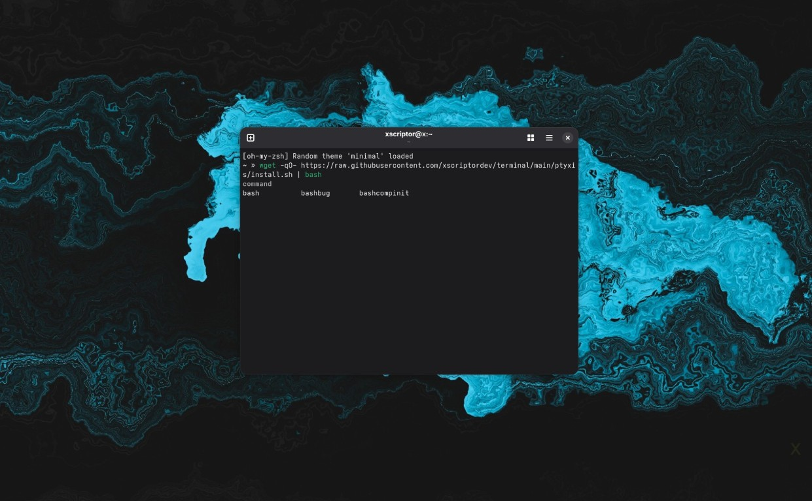

# Xscriptor Ptyxis Themes

---

## Previews

<p align="center">
  
</p>
<p align="center">
  
</p>
<p align="center">
  
</p>

## Files
- `install.sh`: Installs palettes to `~/.local/share/org.gnome.Ptyxis/palettes`, sets the default theme, and adds aliases.
- `themes/*.palette`: Palettes ready to use with Ptyxis:
  - `xscriptor-theme.palette`
  - `xscriptor-theme-light.palette`
  - `x-retro.palette`
  - `x-dark-candy.palette`
  - `x-candy-pop.palette`
  - `x-sense.palette`
  - `x-summer-night.palette`
  - `x-nord.palette`
  - `x-nord-inverted.palette`
  - `x-greyscale.palette`
  - `x-greyscale-inverted.palette`
  - `x-dark-colors.palette`
  - `x-persecution.palette`
  - `x-dark-one.palette`

## Requirements
- Ptyxis installed.
- `sed`, `bash` or `zsh`.
- `curl` or `wget`.

## Installation
- One-liner:
```bash
wget -qO- https://raw.githubusercontent.com/xscriptordev/terminal/main/ptyxis/install.sh | bash
```

or

- Download the repo, enter the directory, and run the installer:
  - `chmod +x install.sh && ./install.sh`
- What the installer does:
  - Uses local `.palette` files if present; otherwise downloads them from the repository.
  - Copies all palettes to `~/.local/share/org.gnome.Ptyxis/palettes`.
  - Sets `xscriptor-theme` as default (`Primary=true`) and clears `Primary` for the others.
  - Appends aliases to `~/.bashrc` and `~/.zshrc` for quick theme switching.
- Reload your shell session:
  - `source ~/.bashrc` or `source ~/.zshrc`

## Uninstall
- Remote one‑liner:
```bash
wget -qO- https://raw.githubusercontent.com/xscriptordev/terminal/main/ptyxis/uninstall.sh | bash
# or
curl -fsSL https://raw.githubusercontent.com/xscriptordev/terminal/main/ptyxis/uninstall.sh | bash
```
- Local:
```bash
chmod +x uninstall.sh && ./uninstall.sh
```

## Switching Themes
- Generic function:
  - `ptyx <theme_basename>`
  - Example: `ptyx x-nord` marks `x-nord.palette` as `Primary=true`.
- Ready-to-use aliases:
  - City names: `ptyxx`, `ptyxmadrid`, `ptyxlahabana`, `ptyxseul`, `ptyxmiami`, `ptyxparis`, `ptyxtokio`, `ptyxoslo`, `ptyxhelsinki`, `ptyxberlin`, `ptyxlondon`, `ptyxpraga`, `ptyxbogota`

## Notes
- Ptyxis looks for palettes in `~/.local/share/org.gnome.Ptyxis/palettes`. The `Primary` flag defines the default palette.
- If changes are not reflected immediately, open a new Ptyxis window or select the palette in preferences.
- To set a different default, run `ptyx <name>` to mark it as `Primary=true`.

## Troubleshooting
- Aliases not available:
  - Run `source ~/.bashrc` or `source ~/.zshrc`.
- Theme not visible:
  - Verify the `.palette` file exists in `~/.local/share/org.gnome.Ptyxis/palettes`.
- Theme change not applied:
  - Ensure only one palette has `Primary=true`; use `ptyx <name>` to update flags.
