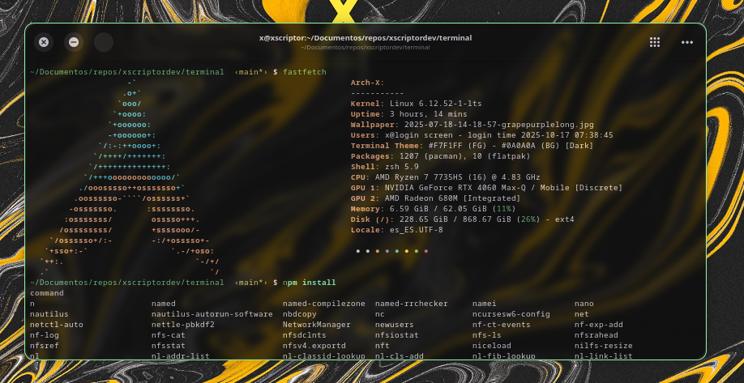

# Xscriptor Themes for Ptyxis Terminal

*Previews*:
<p align="center">
  
  
</p>
<p align="center">
  
  
</p>

Instructions:
```shell
mkdir -p ~/.local/share/org.gnome.Ptyxis/palettes
cp Xscriptor-Dark-Candy.palette ~/.local/share/org.gnome.Ptyxis/palettes/
# for example
```


Then select this from your terminal.
